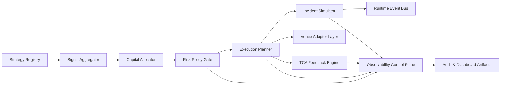

# Architecture

## System View

## Module Responsibilities

- `Strategy Registry`: strategy lifecycle, versioning, enable/disable flags.
- `Signal Aggregator`: normalized strategy outputs and confidence blending.
- `Capital Allocator`: per-book capital shares, exposure budgets, concentration limits, turnover shaping.
- `Risk Policy Gate`: hard limits and policy-based approvals.
- `Execution Planner`: order intent creation, route suggestion, urgency profile.
- `Incident Simulator`: regime selection, fault injection, replay frame generation.
- `Runtime Event Bus`: ordered event timeline for incident and operational traces.
- `TCA Feedback Engine`: slippage/cost attribution and policy feedback.
- `Observability Control Plane`: health checks, anomaly detection, incident timeline.

## Runtime Contracts

- deterministic fixtures by default
- explicit artifact outputs (`md`, `csv`, `json`)
- policy override and approvals audit trail
- strategy plugin lifecycle trace (`initialize`, `composite-published`, `run-completed`)
- incident simulation traces (`timeline`, `replay`, `fault summary`)
- no external secrets required for baseline runs

## Future Extensions

- multi-agent strategy coordination protocols
- systemic risk propagation simulator
- policy sandbox for intervention experiments
