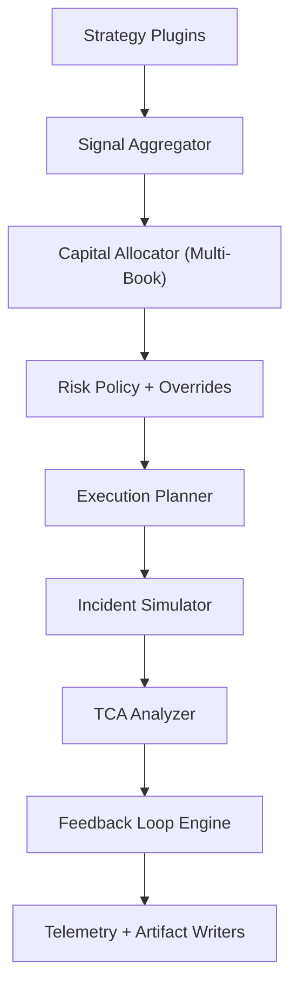

# Module Guide

## Runtime Layers

## Module Responsibilities

`FundLaunch.Platform.Core/StrategyPluginRegistry.cs`
- Strategy plugin registration and lifecycle hooks.
- Hook events: initialize, composite-published, run-completed.

`FundLaunch.Platform.Core/CapitalAllocator.cs`
- Multi-book allocation with capital-share scaling.
- Portfolio roll-up with deterministic symbol ordering.

`FundLaunch.Platform.Core/PolicyOverrideEngine.cs`
- Applies approved policy overrides to risk limits.
- Emits audit trail entries for applied, pending, expired, and unsupported requests.

`FundLaunch.Platform.Core/RiskGate.cs`
- Enforces gross, net, turnover, and per-symbol risk limits.

`FundLaunch.Platform.Core/ExecutionPlanner.cs`
- Converts allocation deltas into execution intents and route/urgency profiles.

`FundLaunch.Platform.Core/IncidentSimulator.cs`
- Selects market regime and applies deterministic fault injection.
- Produces replay frames and incident timeline events.

`FundLaunch.Platform.Core/TcaAnalyzer.cs`
- Calculates fill-rate, slippage, and cost metrics from baseline vs adjusted intents.
- Produces route-level summaries.

`FundLaunch.Platform.Core/FeedbackLoopEngine.cs`
- Generates route-tuning recommendations.
- Applies guardrail decisions: approved, blocked, or monitor.

`FundLaunch.Platform.Core/TelemetryBuilder.cs`
- Fuses risk, incident, TCA, and feedback states into control-plane telemetry.

`FundLaunch.Platform.Core/ArtifactWriter.cs`
- Writes internal detailed runtime artifacts to `reports/`.

`FundLaunch.Platform.Core/ShowcasePackWriter.cs`
- Writes public-safe, sanitized showcase artifacts to `artifacts/showcase/public/`.

## Deterministic Controls

- The deterministic scenario carries a fixed UTC timestamp.
- All modules consume that timestamp for event and audit consistency.
- CLI supports explicit override with `--fixed-ts=<ISO-8601 UTC>`.
